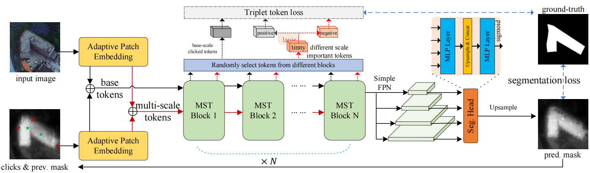

## [MST: Adaptive Multi-Scale Tokens Guided Interactive Segmentation](https://arxiv.org/abs/2401.04403)

<p align="center">
  
</p>

<p>
Interactive segmentation has gained significant attention due to its applications in human-computer interaction and data annotation. To address the challenge of target scale variations in interactive segmentation, we propose a novel multi-scale token fusion algorithm. This algorithm selectively fuses only the most important tokens, enabling the model to better capture multi-scale characteristics in important regions.
To further enhance the robustness of multi-scale token selection, we introduce a token learning algorithm based on contrastive loss. This algorithm fully utilizes the discriminative information between target and background multi-scale tokens, effectively improving the quality of selected tokens. Extensive benchmark testing demonstrates the effectiveness of our approach in addressing multi-scale issues.
</p>

## Environment
Training and evaluation environment: Python 3.9+, PyTorch > 1.0, CUDA. Run the following command to install required packages.
```
pip install -r requirements.txt
```

You need to configue the paths to the datasets in `config.yml` before training or testing. 

## Dataset

A script `download_datasets.sh` is prepared to download and organize required datasets.

| Dataset   |                      Description             |           Download Link              |
|-----------|----------------------------------------------|:------------------------------------:|
|MS COCO    |  118k images with 1.2M instances (train)     |  [official site][MSCOCO]             |
|LVIS v1.0  |  100k images with 1.2M instances (total)     |  [official site][LVIS]               |
|COCO+LVIS* |  99k images with 1.5M instances (train)      |  [original LVIS images][LVIS] + <br> [combined annotations][COCOLVIS_annotation] |
|SBD        |  8498 images with 20172 instances for (train)<br>2857 images with 6671 instances for (test) |[official site][SBD]|
|Grab Cut   |  50 images with one object each (test)       |  [GrabCut.zip (11 MB)][GrabCut]      |
|Berkeley   |  96 images with 100 instances (test)         |  [Berkeley.zip (7 MB)][Berkeley]     |
|DAVIS      |  345 images with one object each (test)      |  [DAVIS.zip (43 MB)][DAVIS]          |
|Pascal VOC |  1449 images with 3417 instances (test)      |  [official site][PascalVOC]          |
|COCO_MVal  |  800 images with 800 instances (test)        |  [COCO_MVal.zip (127 MB)][COCO_MVal] |

[MSCOCO]: https://cocodataset.org/#download
[LVIS]: https://www.lvisdataset.org/dataset
[SBD]: http://home.bharathh.info/pubs/codes/SBD/download.html
[GrabCut]: https://github.com/saic-vul/fbrs_interactive_segmentation/releases/download/v1.0/GrabCut.zip
[Berkeley]: https://github.com/saic-vul/fbrs_interactive_segmentation/releases/download/v1.0/Berkeley.zip
[DAVIS]: https://github.com/saic-vul/fbrs_interactive_segmentation/releases/download/v1.0/DAVIS.zip
[PascalVOC]: http://host.robots.ox.ac.uk/pascal/VOC/
[COCOLVIS_annotation]: https://github.com/saic-vul/ritm_interactive_segmentation/releases/download/v1.0/cocolvis_annotation.tar.gz
[COCO_MVal]: https://github.com/saic-vul/fbrs_interactive_segmentation/releases/download/v1.0/COCO_MVal.zip

## Demo
<p align="center">
  
</p>

An example script to run the demo. 
```
python demo.py --checkpoint=weights/mst-3s-slim-448-base.pth --gpu 0
```

## Evaluation

Before evaluation, please download the datasets and models, and then configure the path in `config.yml`.

Download our model, please download below 3 zipped files and extract before use:

- [Model Zoo](https://cuhko365-my.sharepoint.com/:f:/g/personal/xulong_cuhk_edu_cn/EjwcfWorCwZGsOayrEP9ymkBhHnlnACdFYpVDgEoCVqupA?e=wh45gO)

Use the following code to evaluate the `MST-3s` model.

```
python evaluate_model.py NoBRS\ 
--gpu=0\
--checkpoint=weights/mst-3s-slim-448-base.pth\
--datasets=DAVIS,LoveDASMALL,LoveDAMEDIUM,LoveDALARGE,LoveDAHUGE\
--cf-n=3\
--acf\
--n-clicks=20 \
--target-iou=0.9\
--inference_size=448
```

## Training

Before training, please download the [MAE](https://github.com/facebookresearch/mae) pretrained weights (click to download: [ViT-Base](https://dl.fbaipublicfiles.com/mae/pretrain/mae_pretrain_vit_base.pth), [ViT-Large](https://dl.fbaipublicfiles.com/mae/pretrain/mae_pretrain_vit_large.pth), [ViT-Huge](https://dl.fbaipublicfiles.com/mae/pretrain/mae_pretrain_vit_huge.pth)) and configure the dowloaded path in `config.yml`

Please also download the pretrained SimpleClick models from [here](https://github.com/uncbiag/SimpleClick).

Use the following code to train a huge model on C+L: 
```
python dis_train.py models/adaptivevit_base448_cclvs.py\ 
    --batch-size 60\
    --model_base_name cclvs_adaptivevit_base448\
    --exp-name 3s_mst\
    --gpus 0,1,2,3,4,5\
    --dport 29500\
    --workers 2\
    --img_size 448\
    --amp
```

## Experiment

| Res        | Train Data   | Arch   |      | 3s                                                                 |     | 6s                                                                 |     |
|------------|--------------|--------|------|---------------------------------------------------------------------|-----|---------------------------------------------------------------------|-----|
| 448*448    | COCO-LVIS    | ViT-B  | +CL  | [github](https://github.com/hahamyt/mst/tree/vit-b-cl)            | -   | [github](https://github.com/hahamyt/mst/tree/vit-b-cl)            | -   |
|            |              |        | +MST | [github](https://github.com/hahamyt/mst/tree/mst-448)             | -   | [weight](https://github.com/hahamyt/mst/tree/mst-448)             | -   |
|            |              |        | +MST+CL | [github](https://github.com/hahamyt/mst/tree/mst-448)          | -   | [weight](https://github.com/hahamyt/mst/tree/mst-448)             | -   |
| 224*224    | COCO-LVIS    | ViT-B  | +UpConv | [github](https://github.com/hahamyt/mst/tree/upconv)             | [weight](https://github.com/hahamyt/mst/tree/upconv) | [github](https://github.com/hahamyt/mst/tree/upconv) | [weight](https://github.com/hahamyt/mst/tree/upconv) |
|            |              |        | +AT  | [github](https://github.com/hahamyt/mst/tree/at)                 | [weight](https://github.com/hahamyt/mst/tree/at)        | [github](https://github.com/hahamyt/mst/tree/at) | [weight](https://github.com/hahamyt/mst/tree/at)        |
|            |              |        | +IT  | [github](https://github.com/hahamyt/mst/tree/it)                 | [weight](https://github.com/hahamyt/mst/tree/it)        | [github](https://github.com/hahamyt/mst/tree/it) | [weight](https://github.com/hahamyt/mst/tree/it)        |
|            |              |        | +MST | [github](https://github.com/hahamyt/mst/tree/mst-224)            | [weight](https://github.com/hahamyt/mst/tree/mst-224)   | [github](https://github.com/hahamyt/mst/tree/mst-224) | [weight](https://github.com/hahamyt/mst/tree/mst-224)   |
|            |              |        | +MST+CL | [github](https://github.com/hahamyt/mst/tree/mst-224)          | [weight](https://github.com/hahamyt/mst/tree/mst-224)   | [github](https://github.com/hahamyt/mst/tree/mst-224) | [weight](https://github.com/hahamyt/mst/tree/mst-224)   |
|            |              | ViT-L  | +MST | [github](https://github.com/hahamyt/mst/tree/mst-224-large)      | -   | -                                                                   | -   |
|            |              |        | +MST+CL | [github](https://github.com/hahamyt/mst/tree/mst-224-large)    | -   | -                                                                   | -   |
| 1024*1024  | COCO-LVIS+HQ | ViT-B  | +MST-3s | [github](https://github.com/hahamyt/mst/tree/mst-1024-hqseg44k) | [weight](https://github.com/hahamyt/mst/tree/mst-1024-hqseg44k) | - | - |
| Multi-Scale Datasets | | | | [Download Link](https://drive.google.com/file/d/1ryl2uqV99WV9_XUbOWNQbfvYGqGbJFg7/view?usp=sharing) | | | |


## Citation

```
@article{xu2024mst,
  title={MST: Adaptive Multi-Scale Tokens Guided Interactive Segmentation},
  author={Xu, Long and Li, Shanghong and Chen, Yongquan and Luo, Jun and Lai, Shiwu},
  journal={arXiv preprint arXiv:2401.04403},
  year={2024}
}
```

## Acknowledgement
Our project is developed based on [RITM](https://github.com/SamsungLabs/ritm_interactive_segmentation) and [SimpleClick](https://github.com/uncbiag/SimpleClick)

